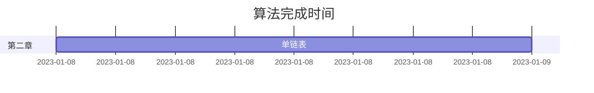

[中文](README.md)|[ENGLISH](README_EN.md) 
# 简介
数据结构（C语言版 第2版）——严蔚敏 章节及练习题源码。 

使用C++/C语言编写

# 1、如何运行
打开库中CMakeLists文件，重新加载即可

## 1.1、 运行环境
运行IDE：CLion

# 2、项目概要
## 2.1、表格
| 章节  | 章名  |
|:---:|:---:|
| 第一章 | 绪论  |
| 第二章 |线性表|
| 第三章 |栈和队列|
| 第四章 |串、数组和广义表|
| 第五章 |数和二叉树|
|第六章|图|
|第七章|查找|
|第八章|排序|

## 计划表

