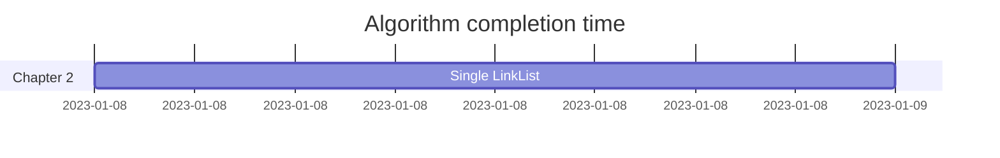

[中文](README.md)|[ENGLISH](README_EN.md)
# Brief Introduction
BOOK: DATA STRUCTURE IN C (2ND EDITION).YanWeimin  
CODE: Chapter and its exercise source  
Programming Language: C++  

#  How to run
Reload the CMakeLists file

## 1.1 Operating environment
IDE：CLion

# Project Summary
## 2.1 Table
| Chapter | Name  |
|:-------:|:---:|
|   one   | Introduction  |
|   two   |Linear list|
|  three  |Stack and queue|
|  four   |Strings, arrays, and generalized tables|
|  five   |Numbers and binary trees|
|   six   |Graph|
|  seven  |Search|
|  eight  |Sort|

## 计划表
